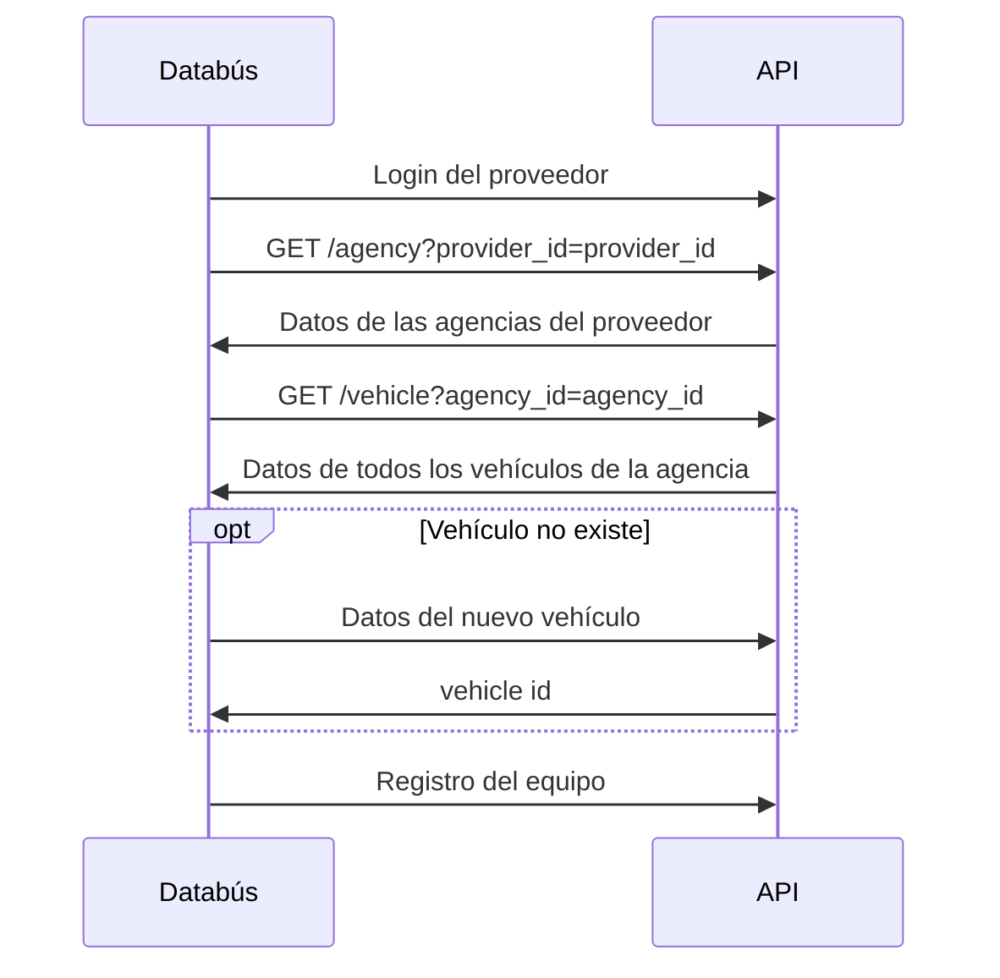
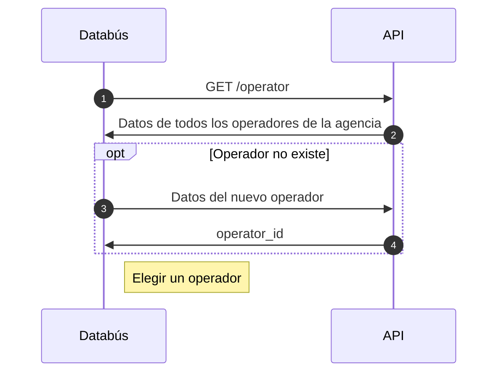

# Arquitectura de la aplicación

## Flujo de uso (interfaz de usuario)

(I) Registro de proveedor de datos

(I) Registro de datos del vehículo
- Obtener datos de vehículos registrados para el proveedor

### Configuración del equipo

Al principio de la operación de la aplicación.

### Identificación del conductor

Cada vez que cambia el conductor (posiblemente hasta varias veces al día)

Antes de confirmar el inicio de un nuevo viaje: identificar al conductor.

### Envío de datos en un viaje

Cuando inicia un viaje

