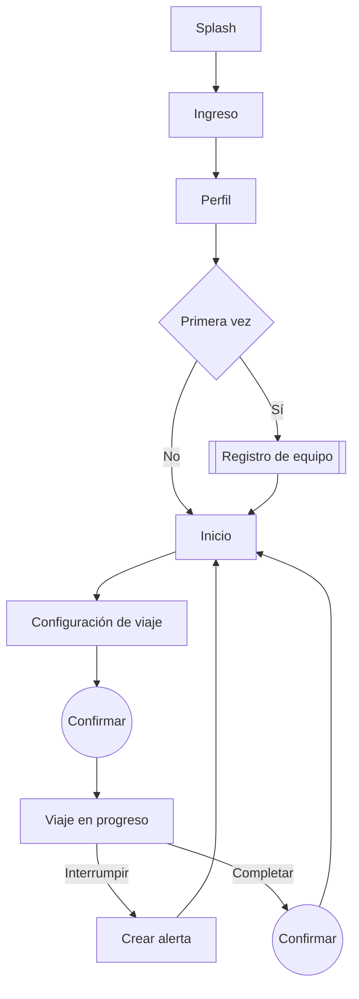

# Interfaz de usuario

```mermaid
flowchart TD
    splash[Splash]
    login[Ingreso]
    profile[Perfil]
    first{Primera vez}
    equipment[[Registro de equipo]]
    home[Inicio]
    config[Configuración de viaje]
    start((Confirmar))
    trip[Viaje en progreso]
    alert[Crear alerta]
    complete((Confirmar))

    splash --> login --> profile --> first
    first -->|Sí| equipment
    first -->|No| home
    equipment --> home
    home --> config 
    config --> start --> trip
    trip -->|Interrumpir| alert --> home
    trip -->|Completar| complete --> home


```

## Registro inicial

### Paso 1

### Paso 2

## Ingreso a la plataforma

## Registro de vehículo

## 

## Viaje en progreso

